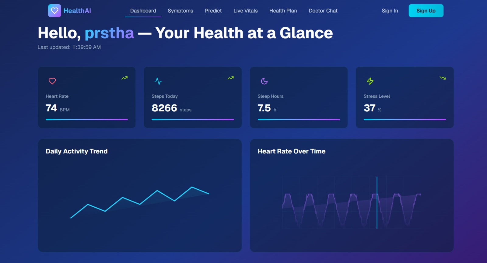
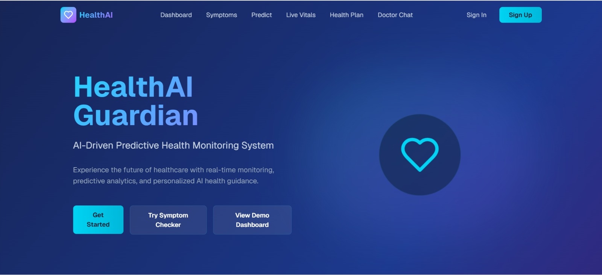
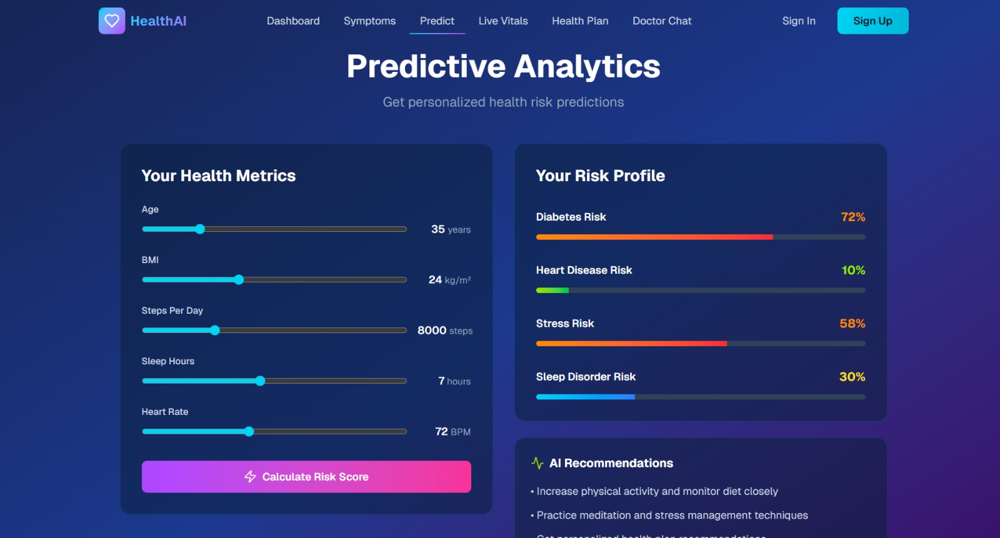
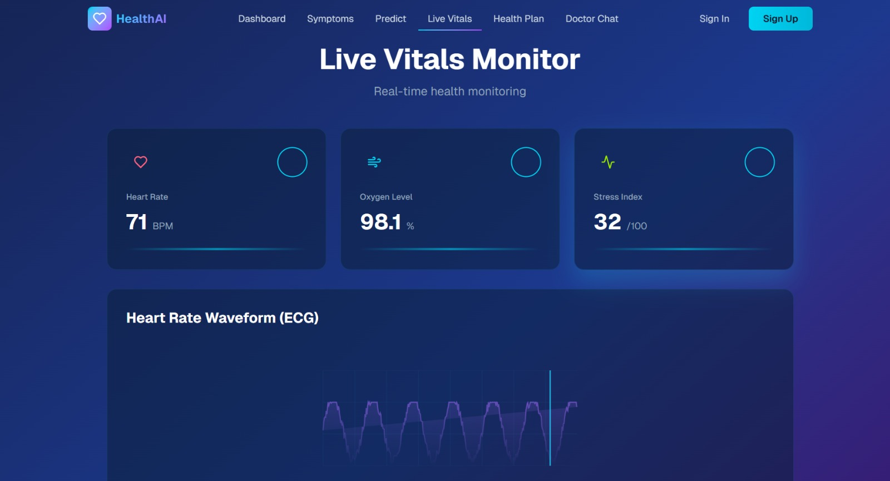
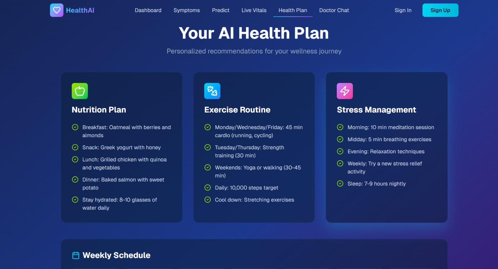
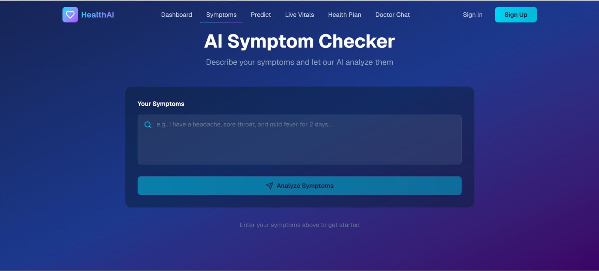
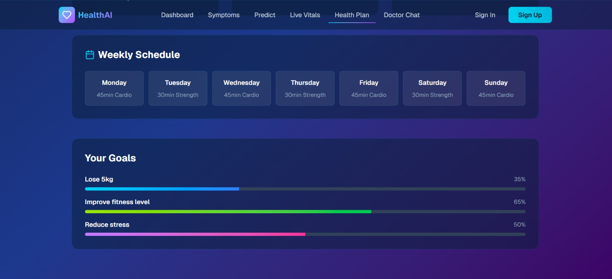
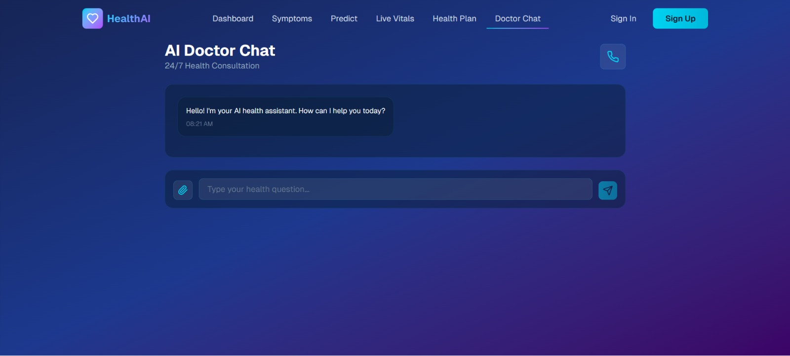

### HealthAI Guardian
  an AI-integrated health monitoring system built for students and young adults to help predict and manage chronic diseases such as diabetes, hypertension, and stress-related disorders.

The goal is to shift healthcare from reactive to proactive, using AI to detect early risk patterns, analyze symptoms, track vitals from wearables, and generate personalized health recommendations.

## Tech Stack

# Frontend

React + TypeScript
Tailwind CSS
Chart.js / Recharts
Axios for API calls

# Backend

FastAPI 
typescript
Pydantic
MongoDB

# AI / ML

TensorFlow Lite
Pretrained symptom-mapping model
Rule-based asthma trigger model
Stress detection model (light ML)

# Dev Tools

Git / GitHub
VS Code
Postman
Mock wearable API (simulated data)

## Workflow
# 1. User Inputs

Symptoms
Lifestyle activity
Sleep patterns
Diet logs (optional)

# 2. Wearable API Simulation

Mock data generates:
Heart rate
SpO2
Steps
Sleep duration
Used in asthma and mental-health patterns.

# 3. Backend Processing

FastAPI receives:

Symptoms
Vitals
Daily logs
Then passes data to:
Asthma trigger detection model
Diabetes risk score model
Stress + mental health classifier

# 4. AI Prediction Layer

Outputs:
Risk percentage
Condition severity
Personalized recommendations
Alerts (e.g., “Possible asthma flare-up risk detected”)

# 5. Frontend Visualization

Risk graphs
Vital cards
Alerts
Personalized plan

## Required Packages

# Frontend
npm install axios react-router-dom tailwindcss chart.js framer-motion

# Backend
pip install fastapi uvicorn scikit-learn numpy pandas pydantic python-multipart

# Optional AI Tools
pip install tensorflow

## website interface

# Impact (Focused on Students)

HealthAI Guardian empowers students by:

Detecting chronic issues early before they become severe
Helping hostel students who cannot access doctors easily
Using wearables to track stress levels during exams
Notifying students about asthma triggers on campus
Creating personalized lifestyle plans for busy college schedules

This leads to:

Better attendance
Higher academic performance
Lower hospital visits
Improved mental well-being

# Future Modifications

Digital health twin
Posture and breathing scanner
Micro expression mood AI 
Live integration with Fitbit / Garmin
NLP chatbot for mental-health counseling
Voice-based symptom recorder
AI-generated diet plans using nutrition APIs
Predictive time-series modeling using LSTMs
Campus-level health heatmaps
Real doctor teleconsultation integration
Emergency SOS alert system for asthma attacks
